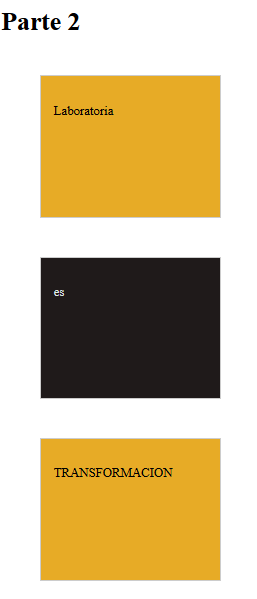
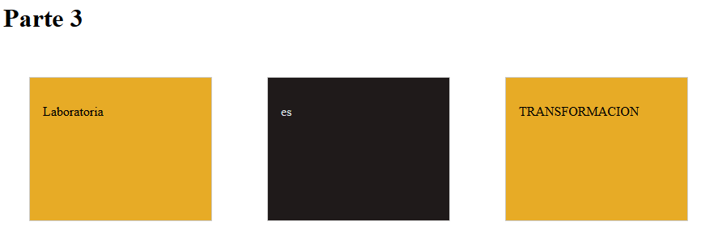

## Bandera Display
Se nos pide realizar banderas solo utilizando la propiedad display.   
Para ello mostraremos las siguientes imagenes a replicar.
1. Primera imagen a replicar.

      
2. Segunda imagen a replicar.

      

3. Tercera imagen a replicar.

      
      
4. Cuarta imagen a replicar.

      
